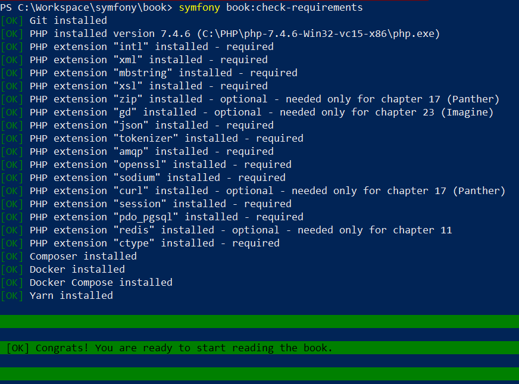

# Symfony 5 : The fast track

https://symfony.com/book

## Prerequisites

- install Git
- install Docker and Docker Compose
- install Redis
- install RabbitMQ

## Start

`symfony new guestbook --version=5.0`